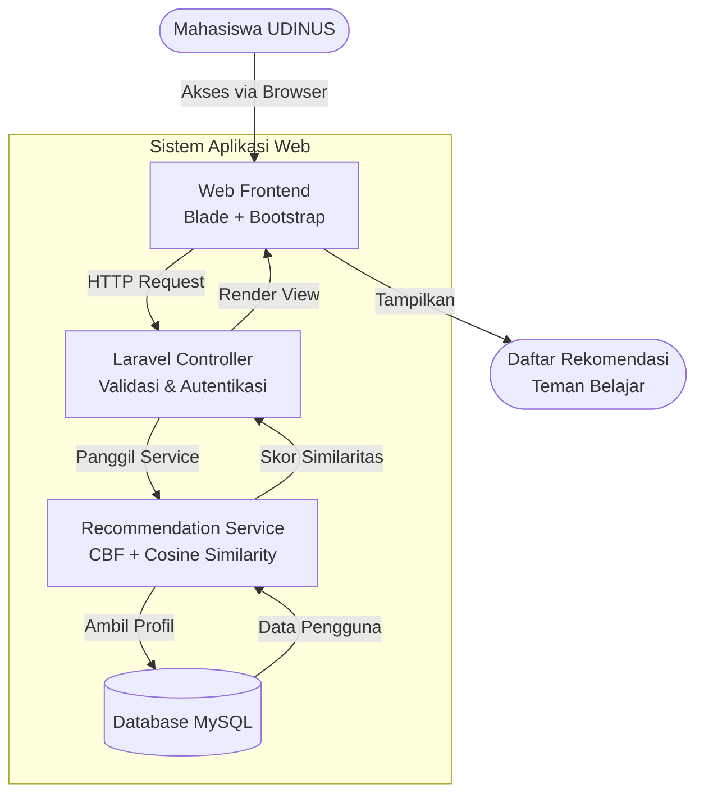
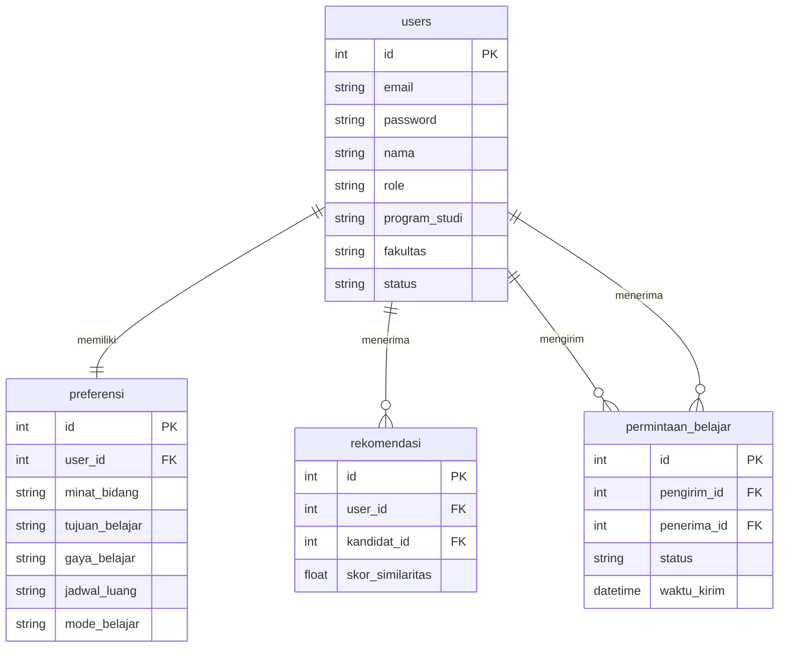
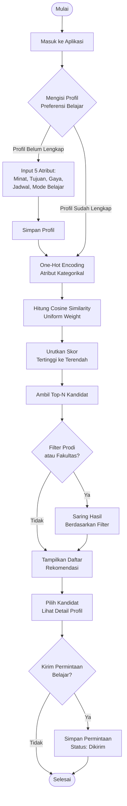
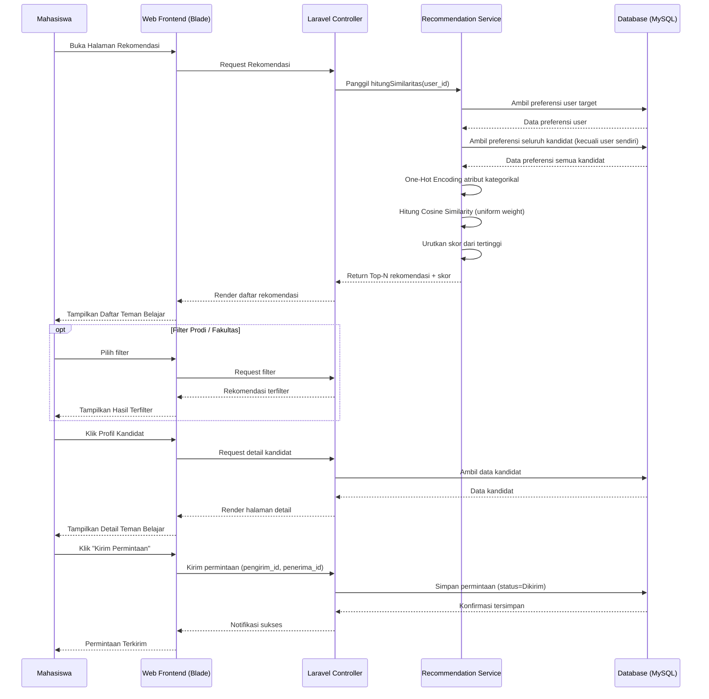

# PRD — Teman Belajar Udinus

## 1. Overview

Saat ini, mahasiswa UDINUS mencari teman belajar secara informal melalui tiga cara: bertanya di grup WhatsApp, mengirim pesan langsung via media sosial, atau mengandalkan teman sekelas yang sudah dikenal. Pendekatan ini menimbulkan empat masalah utama. Pertama, mahasiswa dengan jaringan pertemanan terbatas kesulitan menemukan teman belajar yang sesuai. Kedua, kecocokan preferensi seperti minat, tujuan, dan gaya belajar sulit diidentifikasi sejak awal. Ketiga, perbedaan jadwal luang dan preferensi mode belajar baru disadari setelah kelompok terbentuk. Keempat, mahasiswa cenderung membentuk kelompok hanya dengan teman yang sudah dikenal sehingga peluang kolaborasi lintas program studi menjadi terbatas.

Aplikasi Web Teman Belajar Udinus dirancang untuk menyelesaikan masalah tersebut melalui sistem rekomendasi berbasis Content-Based Filtering (CBF) dengan Cosine Similarity. Pengguna cukup mengisi profil preferensi belajar mereka yang terdiri dari lima atribut — minat bidang belajar, tujuan belajar, gaya belajar, jadwal luang, dan preferensi mode belajar — dan sistem akan secara otomatis mencocokkan profil tersebut dengan profil mahasiswa lain untuk menghasilkan daftar rekomendasi teman belajar yang relevan. Program studi dan fakultas disediakan sebagai filter tambahan sehingga pengguna dapat mempersempit atau memperluas cakupan rekomendasi sesuai kebutuhan. Seluruh perancangan aplikasi mengikuti pendekatan User-Centered Design (UCD) sesuai standar ISO 9241-210:2019 untuk memastikan bahwa setiap keputusan desain didasarkan pada kebutuhan pengguna yang terverifikasi.

## 2. Requirements

- **Pencocokan Sistematis:** Aplikasi harus mampu mencocokkan profil pengguna dengan profil mahasiswa lain berdasarkan lima atribut preferensi belajar menggunakan algoritma Content-Based Filtering dengan Cosine Similarity dan bobot seragam (*uniform weight*).
- **Fleksibilitas Cakupan Rekomendasi:** Pengguna harus dapat memfilter hasil rekomendasi berdasarkan program studi atau fakultas tertentu, atau menampilkan seluruh rekomendasi lintas program studi dan lintas fakultas.
- **Profil Preferensi Belajar:** Setiap pengguna wajib mengisi profil dengan lima atribut preferensi belajar sebelum sistem dapat menghasilkan rekomendasi.
- **Kemudahan Penggunaan:** Aplikasi harus mencapai skor System Usability Scale (SUS) minimal 71 (kategori *good*) yang diukur melalui pengujian dengan minimal 30 responden dari minimal tiga fakultas berbeda.
- **Responsivitas:** Antarmuka aplikasi harus menyesuaikan tampilan pada berbagai ukuran layar perangkat, mulai dari desktop, tablet, hingga mobile.
- **Aksesibilitas:** Berupa aplikasi web yang dapat diakses melalui peramban modern tanpa memerlukan instalasi.
- **Keamanan Data:** Data profil dan preferensi pengguna dilindungi melalui sistem autentikasi berbasis email dan kata sandi.

## 3. Core Features

### 3.1 Fitur Mahasiswa

- **Registrasi dan Login Akun:** Mahasiswa mendaftar menggunakan email UDINUS dan kata sandi, kemudian masuk ke aplikasi untuk mengakses fitur utama.
- **Pengisian Profil Preferensi Belajar:** Mahasiswa mengisi lima atribut preferensi belajar (minat bidang belajar, tujuan belajar, gaya belajar, jadwal luang, preferensi mode belajar) serta data program studi dan fakultas. Profil dapat diperbarui kapan saja ketika kebutuhan belajar berubah.
- **Pencocokan Teman Belajar (Sistem Rekomendasi CBF):** Sistem menghitung kemiripan antara profil mahasiswa target dan profil mahasiswa lain menggunakan One-Hot Encoding dan Cosine Similarity. Hasil perhitungan diurutkan dari skor kemiripan tertinggi dan ditampilkan sebagai daftar rekomendasi Top-N.
- **Filter Program Studi dan Fakultas:** Mahasiswa dapat mempersempit cakupan rekomendasi berdasarkan program studi atau fakultas tertentu, atau menampilkan seluruh rekomendasi tanpa filter untuk kolaborasi lintas disiplin.
- **Detail Profil Teman Belajar:** Mahasiswa dapat melihat informasi lengkap dari setiap kandidat yang direkomendasikan, termasuk preferensi belajar, program studi, dan fakultas.
- **Kirim dan Kelola Permintaan Belajar:** Mahasiswa dapat mengirim permintaan belajar kepada kandidat yang dipilih. Penerima dapat menerima atau menolak permintaan yang masuk.

### 3.2 Fitur Admin

- **Login Admin:** Admin masuk menggunakan akun khusus yang terpisah dari akun mahasiswa.
- **Kelola Data Master:** Admin dapat menambah, mengubah, atau menghapus data master yang menjadi opsi pilihan pada profil mahasiswa, meliputi daftar program studi, fakultas, minat bidang belajar, tujuan belajar, gaya belajar, dan mode belajar.
- **Lihat Statistik Pengguna:** Admin dapat melihat jumlah mahasiswa terdaftar, distribusi per fakultas, dan distribusi per program studi.
- **Kelola Akun Mahasiswa:** Admin dapat melihat daftar mahasiswa terdaftar dan menonaktifkan akun yang bermasalah.

## 3.3. Role dan Permission

Sistem memiliki dua peran pengguna dengan hak akses yang berbeda:

| Fitur | Mahasiswa | Admin |
|-------|:---------:|:-----:|
| Registrasi akun | YA | - |
| Login | YA | YA |
| Isi profil preferensi | YA | - |
| Lihat rekomendasi | YA | - |
| Filter prodi/fakultas | YA | - |
| Kirim permintaan belajar | YA | - |
| Terima/tolak permintaan | YA | - |
| Kelola data master | - | YA |
| Lihat statistik pengguna | - | YA |
| Kelola akun mahasiswa | - | YA |

Pembagian role menggunakan middleware Laravel untuk membatasi akses: mahasiswa tidak dapat mengakses halaman admin, dan admin tidak dapat mengisi profil preferensi atau menerima rekomendasi.

## 4. User Flow

1. **Registrasi:** Mahasiswa membuka aplikasi dan mendaftar menggunakan email serta kata sandi.
2. **Isi Profil Preferensi:** Segera setelah registrasi, pengguna diarahkan ke halaman pengisian profil untuk memilih preferensi pada lima atribut (minat, tujuan, gaya belajar, jadwal, mode belajar) serta mengisi program studi dan fakultas.
3. **Lihat Rekomendasi ("First Win"):** Setelah profil tersimpan, sistem langsung menghitung kemiripan dan menampilkan daftar teman belajar yang direkomendasikan berdasarkan skor Cosine Similarity tertinggi.
4. **Filter Hasil (Opsional):** Pengguna dapat menerapkan filter program studi atau fakultas untuk mempersempit atau memperluas cakupan rekomendasi.
5. **Lihat Detail Profil:** Pengguna mengeklik salah satu kandidat untuk melihat informasi lengkap termasuk preferensi belajar mereka.
6. **Kirim Permintaan:** Jika merasa cocok, pengguna mengirim permintaan belajar. Penerima akan melihat notifikasi permintaan di halaman utama mereka.
7. **Kelola Permintaan:** Penerima dapat menerima atau menolak permintaan. Jika diterima, kedua pengguna terhubung dan dapat melanjutkan komunikasi di luar aplikasi.

## 5. Architecture

Aplikasi dibangun menggunakan arsitektur Model-View-Controller (MVC) dengan framework Laravel. Frontend (Blade Template + Bootstrap) menangani antarmuka pengguna. Backend (Laravel Controller + Service Class) menangani logika bisnis termasuk algoritma Content-Based Filtering. Data disimpan dalam database MySQL yang dikelola melalui Eloquent ORM.



## 6. Database Schema

**1. Tabel `users` (Mahasiswa & Admin)**
- `id` (Integer, Auto Increment): Pengenal unik pengguna.
- `email` (String): Alamat email UDINUS untuk login.
- `password` (String): Kata sandi terenkripsi.
- `nama` (String): Nama lengkap pengguna.
- `role` (Enum): Peran pengguna — `mahasiswa` atau `admin`. Default `mahasiswa`.
- `program_studi` (String, nullable): Program studi mahasiswa. Kosong untuk admin.
- `fakultas` (String, nullable): Fakultas mahasiswa. Kosong untuk admin.
- `status` (Enum): Status akun — `aktif` atau `nonaktif`. Default `aktif`.

**2. Tabel `preferensi` (Preferensi Belajar)**
- `id` (Integer, Auto Increment): Pengenal unik.
- `user_id` (Integer, FK): Relasi ke tabel `users`.
- `minat_bidang` (String): Minat bidang belajar (contoh: Programming, UI/UX, Data Science).
- `tujuan_belajar` (String): Tujuan belajar (contoh: UTS/UAS, Skripsi/TA, Proyek Kelompok).
- `gaya_belajar` (String): Gaya belajar (contoh: Diskusi Aktif, Belajar Mandiri, Visual Interaktif).
- `jadwal_luang` (String): Jadwal luang (contoh: Senin Pagi, Rabu Sore).
- `mode_belajar` (String): Preferensi mode belajar (Daring, Luring, Hybrid).

**3. Tabel `rekomendasi` (Hasil Pencocokan)**
- `id` (Integer, Auto Increment): Pengenal unik.
- `user_id` (Integer, FK): Relasi ke pengguna target.
- `kandidat_id` (Integer, FK): Relasi ke pengguna kandidat.
- `skor_similaritas` (Float): Nilai Cosine Similarity antara kedua pengguna.

**4. Tabel `permintaan_belajar` (Permintaan Belajar)**
- `id` (Integer, Auto Increment): Pengenal unik.
- `pengirim_id` (Integer, FK): Relasi ke pengguna pengirim.
- `penerima_id` (Integer, FK): Relasi ke pengguna penerima.
- `status` (Enum): Status permintaan (Dikirim, Diterima, Ditolak).
- `waktu_kirim` (DateTime): Waktu pengiriman permintaan.



## 7. Tech Stack

- **Backend Framework:** Laravel 12 (Arsitektur MVC, Eloquent ORM, Blade Template Engine)
- **Bahasa Pemrograman:** PHP 8.x (Server-side, memproses logika CBF dan perhitungan Cosine Similarity)
- **Frontend Styling:** Bootstrap (Framework CSS berbasis komponen, sistem grid responsif, komponen UI siap pakai)
- **Database:** MySQL (Relational Database Management System, mendukung query SQL untuk pengelolaan data profil dan preferensi)
- **Autentikasi:** Laravel Breeze / Laravel Auth (Sistem autentikasi bawaan Laravel untuk registrasi dan login mahasiswa)
- **Desain Antarmuka:** Figma (Wireframe, mockup, dan prototipe interaktif high-fidelity)

## 8. Diagrams

### 8.1 Use Case Diagram — Fungsionalitas Aplikasi

Diagram ini menggambarkan interaksi antara dua aktor (Mahasiswa dan Admin) dengan sistem Teman Belajar Udinus. Masing-masing use case merepresentasikan fungsi atau layanan yang disediakan sistem kepada pengguna.

```
┌─────────────────────────────────────────────────────────────┐
│                  Sistem Teman Belajar Udinus                 │
│                                                             │
│                                                             │
│      ┌──────────────┐                                       │
│      │  Registrasi  │                                       │
│      └──────┬───────┘                                       │
│             │                                               │
│      ┌──────┴───────┐        ┌──────────────────┐          │
│      │    Login     │        │ Kelola Profil     │          │
│      │  (Mahasiswa) │        │ Preferensi        │          │
│      └──────┬───────┘        └────────┬─────────┘          │
│             │                         │                     │
│      ┌──────┴─────────────────────────┴──────┐              │
│      │         Lihat Rekomendasi              │              │
│      │         Teman Belajar                  │              │
│      └────┬───────────────────┬──────────────┘              │
│           │ <<extend>>        │ <<include>>                  │
│           │                   │                              │
│  ┌────────┴────────┐  ┌───────┴────────────┐               │
│  │ Filter Prodi /  │  │ Lihat Detail       │               │
│  │ Fakultas        │  │ Profil Kandidat    │               │
│  └─────────────────┘  └───────┬────────────┘               │
│                               │ <<extend>>                   │
│                      ┌────────┴────────────┐               │
│                      │ Kirim Permintaan    │               │
│                      │ Belajar             │               │
│                      └─────────────────────┘               │
│                                                             │
│                      ┌─────────────────────┐               │
│                      │ Terima / Tolak      │               │
│                      │ Permintaan          │               │
│                      └─────────────────────┘               │
│                                                             │
│  ─ ─ ─ ─ ─ ─ ─ ─ ─ ─ ─ ─ ─ ─ ─ ─ ─ ─ ─ ─ ─ ─ ─ ─ ─ ─ ─ ─  │
│                      Fitur Admin                            │
│  ─ ─ ─ ─ ─ ─ ─ ─ ─ ─ ─ ─ ─ ─ ─ ─ ─ ─ ─ ─ ─ ─ ─ ─ ─ ─ ─ ─  │
│                                                             │
│      ┌──────────────┐                                       │
│      │ Login Admin  │                                       │
│      └──────┬───────┘                                       │
│             │                                               │
│      ┌──────┴──────────────────────────┐                    │
│      │      Kelola Data Master          │                    │
│      │  (Prodi, Fakultas, Opsi          │                    │
│      │   Preferensi)                    │                    │
│      └─────────────────────────────────┘                    │
│                                                             │
│      ┌─────────────────┐     ┌─────────────────┐           │
│      │ Lihat Statistik │     │ Kelola Akun      │           │
│      │ Pengguna        │     │ Mahasiswa        │           │
│      └─────────────────┘     └─────────────────┘           │
│                                                             │
└─────────────────────────────────────────────────────────────┘
         ▲                                     ▲
         │                                     │
         │                                     │
   ┌─────┴──────┐                      ┌──────┴─────┐
   │  Mahasiswa │                      │   Admin    │
   └────────────┘                      └────────────┘
```

### 8.2 Activity Diagram — Alur Pencarian dan Rekomendasi Teman Belajar

Diagram ini menggambarkan alur aktivitas dari awal pengguna membuka aplikasi, mengisi profil preferensi, hingga sistem menghasilkan dan menampilkan rekomendasi teman belajar.



### 8.3 Sequence Diagram — Proses Pencocokan Teman Belajar

Diagram ini menggambarkan alur komunikasi antar komponen sistem (Mahasiswa, Frontend Blade, Controller, Recommendation Service, dan Database MySQL) selama proses pencocokan teman belajar berbasis Content-Based Filtering.



### 8.4 Class Diagram — Struktur Data Sistem

Diagram ini menggambarkan kelas-kelas utama dalam sistem beserta atribut, metode, dan relasi antarkelas yang diimplementasikan dalam database.

```
┌─────────────────────────────────┐
│            User                  │
├─────────────────────────────────┤
│ + id: int                        │
│ + email: string                  │
│ + password: string               │
│ + nama: string                   │
│ + role: string                   │
│ + program_studi: string          │
│ + fakultas: string               │
│ + status: string                 │
├─────────────────────────────────┤
│ + registrasi()                   │
│ + login()                        │
│ + updateProfil()                 │
│ + isAdmin(): bool                │
└──────────────┬──────────────────┘
               │ 1
               │ memiliki
               │ 1
┌──────────────┴──────────────────┐
│           Profile                │
├─────────────────────────────────┤
│ + id: int                        │
│ + user_id: int (FK)             │
│ + minat_bidang: string           │
│ + tujuan_belajar: string         │
│ + gaya_belajar: string           │
│ + jadwal_luang: string           │
│ + mode_belajar: string           │
├─────────────────────────────────┤
│ + encodeOneHot()                 │
│ + getVector()                    │
└─────────────────────────────────┘

┌─────────────────────────────────┐
│        SimilarityScore           │
├─────────────────────────────────┤
│ + id: int                        │
│ + user_id: int (FK)             │
│ + kandidat_id: int (FK)         │
│ + skor_similaritas: float        │
├─────────────────────────────────┤
│ + hitungCosineSimilarity()      │
│ + getTopN()                      │
└─────────────────────────────────┘
               │
               │ menghasilkan
               │
┌──────────────┴──────────────────┐
│       StudyRequest               │
├─────────────────────────────────┤
│ + id: int                        │
│ + pengirim_id: int (FK)         │
│ + penerima_id: int (FK)         │
│ + status: string                 │
│ + waktu_kirim: datetime          │
├─────────────────────────────────┤
│ + kirim()                        │
│ + terima()                       │
│ + tolak()                        │
└─────────────────────────────────┘
```

Relasi antarkelas:
- **User** (1) ────── (1) **Profile**: Setiap user mahasiswa memiliki tepat satu profil preferensi.
- **User** (1) ────── (*) **SimilarityScore**: Setiap user dapat menerima banyak hasil rekomendasi.
- **SimilarityScore** (*) ────── (1) **User**: Setiap rekomendasi mengacu pada satu user kandidat.
- **User** (1) ────── (*) **StudyRequest**: Setiap user dapat mengirim dan menerima banyak permintaan.
- **User** dengan role `admin` tidak memiliki Profile, SimilarityScore, maupun StudyRequest.
